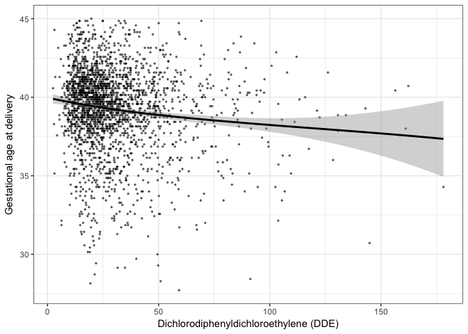
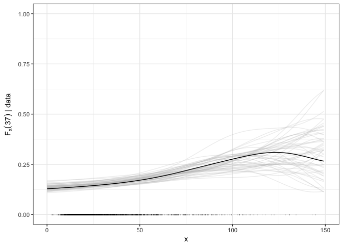
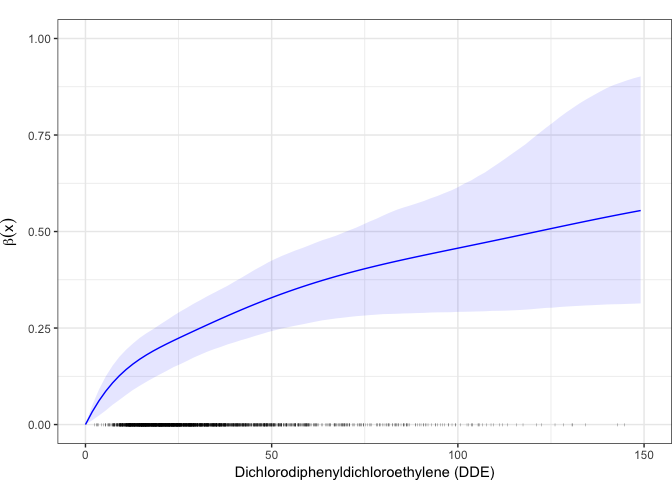
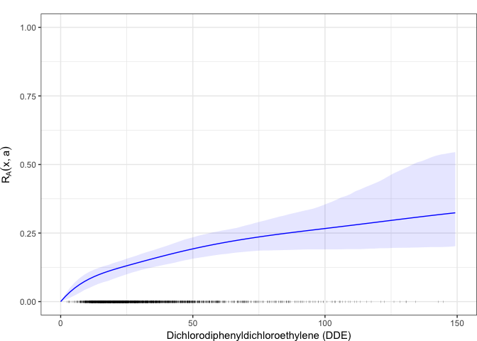
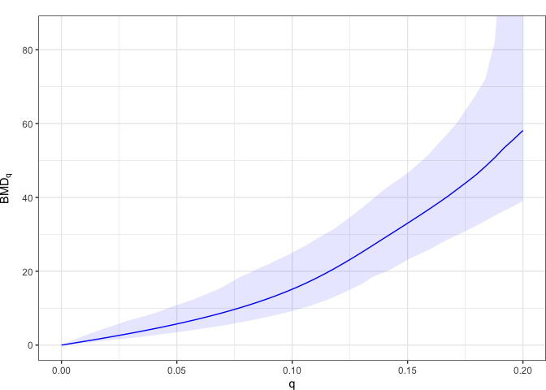

Analysis of the CPP data
================

Analysis of the US Collaborative Perinatal Project (CPP) data on the effect of Dichlorodiphenyldichloroethylene (DDE) on premature delivery [Longnecker et al., (2001)](http://www.thelancet.com/journals/lancet/article/PIIS0140673601053296/abstract) as discussed in [Canale, Durante and Dunson, (2017)](https://arxiv.org/abs/1701.02950)

Load data and packages
======================

Load the CoMiRe set of functions of the 'CoMiRe' package

``` r
library(CoMiRe)
library(splines2)
library(ggplot2)
library(gridExtra)
library(KernSmooth)
```

Load the CPP data

``` r
load("cpp.rda")
x = cpp$dde    # DDE 
y = cpp$gest   # gestational week at delivery
n <- NROW(cpp)
```

The DDE has a clear effect in determining premature births as can be seen from

``` r
ggplot(data=cpp) + geom_point(aes(x=dde, y=gest), alpha=.5, cex=.5) + 
  geom_smooth(aes(x=dde, y=gest), method="loess", span = 1, col=1) + 
  xlab("Dichlorodiphenyldichloroethylene (DDE)") + ylab("Gestational age at delivery") + theme_bw()
```



To have a first quantification we fit a simple logistic model to the dichotomized outcome, i.e. we classify a birth as premature if it occurs before 37 weeks.

``` r
premature <- y < 37
glmfit<- glm(premature ~ x, family="binomial")
summary(glmfit)
```

    ## 
    ## Call:
    ## glm(formula = premature ~ x, family = "binomial")
    ## 
    ## Deviance Residuals: 
    ##     Min       1Q   Median       3Q      Max  
    ## -1.2725  -0.5843  -0.5408  -0.5096   2.1111  
    ## 
    ## Coefficients:
    ##              Estimate Std. Error z value Pr(>|z|)    
    ## (Intercept) -2.160870   0.102249 -21.133  < 2e-16 ***
    ## x            0.014676   0.002468   5.946 2.75e-09 ***
    ## ---
    ## Signif. codes:  0 '***' 0.001 '**' 0.01 '*' 0.05 '.' 0.1 ' ' 1
    ## 
    ## (Dispersion parameter for binomial family taken to be 1)
    ## 
    ##     Null deviance: 2003.2  on 2311  degrees of freedom
    ## Residual deviance: 1970.0  on 2310  degrees of freedom
    ## AIC: 1974
    ## 
    ## Number of Fisher Scoring iterations: 4

CoMiRe estimation
=================

To fit the **CoMiRe** model it is first necessary to fix the following prior parameters:

``` r
J <- 10 
H <- 10
prior <- list(mu0=mean(y), dirpar=rep(1, J)/J, kappa=1, a=2, b=2, H=H, J=J, alpha=1/H)
```

and the following MCMC settings

``` r
mcmc <- list(nrep=5000, nb=2000, thin=5, ndisplay=4)
```

The Gibbs sampling algorithm is executed via

``` r
fit.comire <- comire.gibbs(y, x, mcmc=mcmc, prior=prior, seed=1, max.x=180)
```

    ## Burn in done
    ## 3250 iterations over 7000 
    ## 4500 iterations over 7000 
    ## 5750 iterations over 7000 
    ## 7000 iterations over 7000

Posterior predictive check
==========================

Before assessing the performance of CoMiRe in inference on the additional risk functions and benchmark doses, we first check the model adequacy in terms of goodness of fit. This is done via posterior predictive checks as discussed in Section 3.1 of the paper. 

Specifically, we use the R function `post.pred.check()` to draw samples from the posterior predictive distribution of a smoothed empirical estimate of *F*<sub>*x*</sub>(37).

``` r
below37.comire <- post.pred.check(x, fit.comire, mcmc, H=10, a=37, max.x=180)
```

We draw 50 of these samples and plot them along with the smoothed empirical estimate of *F*<sub>*x*</sub>(37) calculated from the observed sample data in the CPP application.

``` r
below37.true <- locpoly(x=x, y=y<37, degree=0, bandwidth = 20, 
                        gridsize = 100, range.x = c(0, 180))$y
ppc.data <- data.frame(cbind(x=seq(0,180, length=100), 
                            Fx=c(c(below37.comire[,1:50*20])),
                            repl=c(rep(1:50,each=100))))
ppc <-    ggplot(ppc.data, aes(x=x, y=Fx)) + 
  geom_line(alpha=0.25, aes(group=factor(repl)), col="grey") +
  geom_line(data=data.frame(x=seq(0,180, length=100), y=below37.true), aes(x=x, y=y), col=1)+
  ylab(expression(F[x](37)*" | data")) + theme_bw() + 
  geom_point(data=data.frame(x, zero=rep(0,n)), aes(x, zero), alpha=1, cex=.5, pch="|") 
ppc
```



Inference on the conditional density
=============================

We now study the posterior distribution of the conditional density of the response computed for different values *x* of the dose. Specifically, we first subdivide the observed dose exposures in bins with

``` r
break.points <- c(0, 15,30,45,60, 75, 180)
x.cpoints <- c(7.5, 22.5,37.5,52.5,67.5, 125)
groups <- as.numeric(cut(x, breaks = break.points))
xlab <- c("Gestational age at delivery (DDE<15)",
          "Gestational age at delivery (15<DDE<30)",
          "Gestational age at delivery (30<DDE<45)",
          "Gestational age at delivery (45<DDE<60)",
          "Gestational age at delivery (60<DDE<75)",
          "Gestational age at delivery (DDE>75)"
          )
```

Then the pointwise mean and credible bands for the conditional density of the response can be obtained for every *x* in `x.cpoints` as follows

``` r
y.grid <- seq(min(y)-sqrt(var(y)), max(y) + sqrt(var(y)), length = 100) 
all.pdf <- list()
for(j in 1:6)
  {
  pdf_fit <- fit.cdf.mcmc(x.cpoints[j], y.grid=y.grid, fit.comire, mcmc=mcmc, H=10, max.x=180)
  data <- data.frame(pdf_fit, y.grid)
  names(data)[1:3] <- c("mean","low","upp")
 
   pdf.j <- ggplot(data) +  
    geom_line(aes(x=y.grid, y=mean), col="blue") +
    geom_ribbon(aes(ymax=upp, ymin=low, x=y.grid), fill=4,alpha=.1) + 
    coord_cartesian(xlim=c(25,48)) +  labs(x=xlab[j], y="") + 
    theme_bw() + coord_cartesian(ylim=c(0, 0.25)) +
    theme(plot.margin=unit(c(1,0,0,0),"lines"), axis.title=element_text(size=10))
  
  all.pdf[[j]] <- pdf.j
}

grid.arrange(all.pdf[[1]],all.pdf[[2]],all.pdf[[3]],all.pdf[[4]],all.pdf[[5]],all.pdf[[6]], ncol=3, nrow=2)
```


Inference on the interpolating function
=======================================

Based on the above Figure, both adverse and non-adverse profiles are found across all the predictor space. What crucially changes with DDE is the degree *β*(*x*) of susceptibility of the women to the adverse effects of this chemical.

The pointwise posterior mean and the 95% credible bands of *β*(*x*) can be obtained with

``` r
beta.data <- data.frame(beta=fit.comire$post.means$beta,
                        low=fit.comire$ci$beta[1,], upp=fit.comire$ci$beta[2,], 
                        dde=seq(0,180, length=100))
betaplot <- ggplot(beta.data, aes(dde,beta)) + geom_line(lty=1, col=4) + 
  geom_ribbon(aes(ymax=upp, ymin=low), fill=4,alpha=.1) +
  labs(y=expression(beta(x)), x="Dichlorodiphenyldichloroethylene (DDE)")+ theme_bw() + 
  theme(plot.margin=unit(c(1,0,0,0),"lines")) + 
  coord_cartesian(ylim=c(0,1), xlim=c(0,180))
betaplot + geom_point(data=data.frame(x, zero=rep(0,n)), aes(x, zero), alpha=1, cex=.5, pch="|") 
```



The plot highlights a notable increment in the probability of the most adverse health profile at low-dose exposures.

Additional risk and BMD
=======================

To perform benchmark dose analysis by means of the additional risk function, we consider the standard preterm threshold *a* = 37.

To obtain the additional risk function for a given threshold use the `add.risk()` function and plot it as a function of `x` with `riskplot()`.

``` r
risk.data <- add.risk(a=37, fit=fit.comire, mcmc=mcmc, xgrid=seq(0,max(x), length=100), y=y)
riskplot(risk.data$summary.risk, xlabel="Dichlorodiphenyldichloroethylene (DDE)", x=x)
```



The notable increment of the risk function at low-dose exposures suggests conservative benchmark doses. This is confirmed by looking at the BMD<sub>*q*</sub> expressed as a function of *q*. The latter can be obtained with the function `BMD()` which extracts estimates for the benchmark dose related to a given risk function for differente values of risk *q*.

A graphical representation of the BMD<sub>*q*</sub> for the different values of *q* can be obtained with

``` r
bmd.data <- BMD(seq(0,.20, length=50), risk.data$mcmc.risk, x=seq(0,max(x), length=100), alpha=0.05)
bmd.plot(bmd.data)
```



where the solid line represent the pointwise posterior mean of the BMD<sub>*q*</sub> and the shaded areas are the related 95% credible bands.

Typical values of *q* are 1%, 5%, and 10%. The next table reports both the BMD<sub>*q*</sub>, estimated via the posterior mean, and the benchmark dose limit (BMDL<sub>*q*</sub>), estimateted with the lower 5% quantile of the posterior distribution of the corresponding benchmark dose.

``` r
q.values <- c(1,5,10)/100
BMDq <- BMD(q.values, risk.data$mcmc.risk, x=seq(0,180, length=100), alpha=.05)
knitr::kable(BMDq[c(1,2,5)], digits = 2)
```

|     q|    BMD|  BMDL|
|-----:|------:|-----:|
|  0.01|   0.94|  0.59|
|  0.05|   5.18|  3.41|
|  0.10|  12.92|  8.88|
